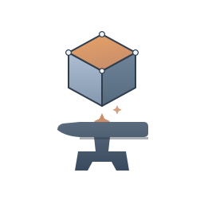

<p align="center">
  
</p>

# partsmith

**A parametric-CAD server built for AI agents.** partsmith wraps
[build123d](https://github.com/gumyr/build123d) (OpenCascade) behind a
small REST API **and** a Model Context Protocol (MCP) endpoint, so an
LLM client like Claude can design real, printable 3D parts by writing
build123d Python — then render, measure, validate, version, and export
them, all over a single HTTP surface.

It's headless, single-file-simple, and designed to live on a small
Linux host behind an authenticating reverse proxy. The container does
no authentication itself — the perimeter is the security boundary (see
[`SECURITY.md`](SECURITY.md)).

## What it does

- **Author** parts in build123d Python (`result = Box(30, 20, 10)`),
  with a library of [helpers](#build123d-helpers) auto-injected for
  common 3D-printing patterns (screw holes, slots, fillets, mounting
  patterns).
- **See inside** designs: 3D shaded views, 2D orthographic projections
  with dimensions, multiview composites, and **cross-sections** through
  any plane — all returned as inline PNGs without leaving the chat.
- **Validate** printability: watertight / manifold / wall-thickness
  checks before you ever open a slicer.
- **Persist + version** designs to disk: every save is a new version,
  with a `diff` that reports source changes + geometry deltas (volume,
  surface area, bounding box) between any two versions.
- **Export** to STL / STEP / 3MF.

Everything works identically over REST and MCP — both share the same
in-process engine, so a model authored via one protocol is visible to
the other.

## Install

### Option A — ZimaOS Custom Install (recommended for homelab)

partsmith ships a `docker-compose.yml` with `x-casaos` metadata in
[**JLay2026/zimaboard-services**](https://github.com/JLay2026/zimaboard-services/tree/main/partsmith).
Paste it into the ZimaOS dashboard's Custom Install, fill the form,
click Install. See
[`docs/partsmith-setup.md`](https://github.com/JLay2026/zimaboard-services/blob/main/docs/partsmith-setup.md)
there for the full walkthrough (including the one-time bind-mount chown
step).

### Option B — `docker run` from the published image

The image is published to GHCR on every release:

```bash
# Pre-create bind-mount dirs as uid 1000 (the container's user).
# Skipping this makes every export/render return a permission-denied 500.
sudo mkdir -p /srv/partsmith/workspace /srv/partsmith/renders
sudo chown -R 1000:1000 /srv/partsmith/workspace /srv/partsmith/renders

docker run -d --name partsmith \
  -p 127.0.0.1:8123:8123 \
  -v /srv/partsmith/workspace:/workspace \
  -v /srv/partsmith/renders:/renders \
  ghcr.io/jlay2026/partsmith:latest

curl http://127.0.0.1:8123/health
# {"status":"ok","version":"0.3.1"}
```

Pin a specific version with `:0.3.1` instead of `:latest`. Available
tags: <https://github.com/JLay2026/partsmith/pkgs/container/partsmith>.

### Option C — local dev (build from source)

```bash
git clone https://github.com/JLay2026/partsmith
cd partsmith
pip install -e .
python -m uvicorn src.server:app --host 0.0.0.0 --port 8123
curl http://localhost:8123/health
```

Or build the container locally: `docker compose up -d --build`
(pre-create + chown `workspace/` and `renders/` as uid 1000 first, as
above).

## Connect an MCP client

partsmith exposes a Streamable-HTTP MCP server at `/mcp/`. URL-based
MCP clients (Cowork's managed MCP UI, Claude Code, etc.) register it
directly — no shim process.

| Field | Value |
|---|---|
| URL | `<your-base-url>/mcp/` (trailing slash required) |
| Transport | `streamable-http` |
| Auth | Whatever your reverse proxy enforces (send headers via the client's Headers field) |

On connect, the client sees the full `partsmith_*` tool surface (17
tools as of v0.3.1).

## build123d helpers

The execution namespace for every `create_model` / `save_design` call
has `from build123d import *` and `import numpy as np` pre-loaded, plus
seven helpers for patterns that recur in real designs:

| Helper | What it makes |
|---|---|
| `through_hole(diameter, depth)` | Plain cylindrical hole |
| `screw_hole(diameter, depth, countersink=True, ...)` | Machine-screw hole, M-series defaults |
| `hex_hole(across_flats, depth)` | Nut pocket (M3=5.5, M4=7, M5=8, M6=10 mm) |
| `slot(length, width, depth)` | Stadium-shaped slot for adjustable mounts |
| `chamfer_edges(part, radius, edges='all'\|'top'\|'bottom'\|'side')` | Chamfer with edge selection |
| `fillet_top_edges(part, radius)` | Round all top-face edges |
| `screw_pattern(positions, hole_func)` | Apply a hole at each (x, y) |

```python
# Wall bracket: 4 countersunk holes, top edges filleted
body = Box(100, 50, 10)
holes = screw_pattern(
    [(10, 10), (90, 10), (10, 40), (90, 40)],
    lambda: screw_hole(3.2, 10),
).moved(Location((0, 0, 10)))
result = fillet_top_edges(body - holes, radius=1.5)
```

## Design store + versioning

Models live in memory and are wiped on container restart. **Designs**
live on disk under `{workspace}/designs/{name}/` and survive restarts,
with one `vN.py` + `vN.json` pair per version:

```
designs/bracket/
  v1.py  v1.json
  v2.py  v2.json
  v3.py  v3.json
```

- `save_design(name, code)` appends the next version (or pass
  `version=N` to overwrite a slot).
- `load_design(name)` loads the latest (or a specific version) and
  registers it as a model.
- `diff_designs(name, v1, v2)` returns a unified source diff plus
  volume / surface-area / bounding-box deltas — "is v3 actually better
  than v2 in the ways I care about?" answered at a glance.

## REST tool surface

| Endpoint | Method | Purpose | Since |
|---|---|---|---|
| `/health` | GET | `{"status":"ok","version":"X"}` | v0.1 |
| `/model/create` | POST | Execute build123d code, store as named model, return geometry + base64 preview | v0.1 |
| `/model/modify` | POST | Re-execute for an existing name | v0.1 |
| `/model/list` | GET | List loaded models | v0.1 |
| `/model/{name}/measure` | GET | Bounding box, volume, area, topology counts | v0.1 |
| `/render/3d` | POST | 3D shaded view (Lambertian), base64 PNG | v0.1 |
| `/render/2d` | POST | 2D orthographic view + optional dimensions | v0.1 |
| `/render/multiview` | POST | Composite: front + right + top + iso | v0.1 |
| `/render/section` | POST | **2D cross-section** on XY/XZ/YZ at an offset | v0.2.6 |
| `/render/all` | POST | Render every standard view to disk | v0.1 |
| `/export` | POST | Export STL / STEP / 3MF as binary | v0.1 |
| `/analyze/printability` | POST | Watertight / manifold / wall-thickness check | v0.1 |
| `/workspace/{filename}` | GET | Stream a previously-exported file (MCP large-file fallback) | v0.2 |
| `/design/save` | POST | Save a design version (also executes as a model) | v0.2.4 |
| `/design/list` | GET | List saved designs (latest of each) | v0.2.4 |
| `/design/{name}` | GET | Load source + metadata (`?version=N`) | v0.2.4 |
| `/design/{name}` | DELETE | Delete a version, or all (`?version=N`) | v0.2.4 |
| `/design/{name}/load` | POST | Load + execute a design as a model (`?version=N`) | v0.2.4 |
| `/design/{name}/versions` | GET | List version numbers | v0.2.7 |
| `/design/{name}/diff` | GET | Diff two versions (`?v1=&v2=`) | v0.2.7 |

## MCP tools

All prefixed `partsmith_` to avoid collisions in multi-server setups.

| Tool | Purpose | Since |
|---|---|---|
| `partsmith_health` | Status + version + transport | v0.2 |
| `partsmith_create_model` | Execute build123d code, register as model, return geometry + preview | v0.2 |
| `partsmith_modify_model` | Re-execute against an existing name | v0.2 |
| `partsmith_list_models` | List loaded models | v0.2 |
| `partsmith_measure_model` | Bounding box, volume, area, counts | v0.2 |
| `partsmith_render_3d` | 3D shaded view | v0.2 |
| `partsmith_render_2d` | 2D orthographic projection | v0.2 |
| `partsmith_render_multiview` | 2×2 composite | v0.2 |
| `partsmith_render_section` | **Cross-section** through a plane | v0.2.6 |
| `partsmith_export` | Export STL / STEP / 3MF | v0.2 |
| `partsmith_analyze_printability` | Watertight / manifold / wall check | v0.2 |
| `partsmith_save_design` | Save a design version | v0.2.4 |
| `partsmith_load_design` | Load + execute a saved design | v0.2.4 |
| `partsmith_list_designs` | List saved designs | v0.2.4 |
| `partsmith_delete_design` | Delete a design / version | v0.2.4 |
| `partsmith_list_versions` | List a design's versions | v0.2.7 |
| `partsmith_diff_designs` | Diff two versions (source + geometry deltas) | v0.2.7 |

### File handoff: inline vs URL

Tools that return files (`partsmith_render_*`, `partsmith_export`)
inline the bytes as base64 when ≤ `PARTSMITH_INLINE_MAX_BYTES`
(default **8 MiB**). Larger payloads persist to the workspace and
return a `url_path` the client fetches via `GET /workspace/<filename>`
with the same auth headers.

| Response shape | When | Client action |
|---|---|---|
| `{"inline": true, "data_b64": "..."}` | ≤ 8 MiB | base64-decode and use |
| `{"inline": false, "url_path": "/workspace/foo.stl"}` | > 8 MiB | GET base_url + url_path |

## Configuration

| Env var | Default | Purpose |
|---|---|---|
| `PARTSMITH_WORKSPACE` | `/workspace` | Where exports + saved designs land |
| `PARTSMITH_RENDERS` | `/renders` | Where rendered PNGs are cached |
| `PARTSMITH_HOST` | `0.0.0.0` | Server bind address |
| `PARTSMITH_PORT` | `8123` | Server bind port |
| `PARTSMITH_MAX_BODY_BYTES` | `1048576` (1 MiB) | Reject REST requests larger than this. `/mcp` is exempt. |
| `PARTSMITH_INLINE_MAX_BYTES` | `8388608` (8 MiB) | MCP file payloads above this return a `url_path` instead of inlining. |

## Operational notes

- **Models are in-memory; designs are on disk.** Container restart
  wipes the model registry (LRU-capped at 32) but never the design
  store. Use `save_design` to persist anything you want to keep.
- **Cross-protocol state is shared** — REST and MCP wrap the same
  `CADEngine`.
- **Single uvicorn worker by default** — concurrent renders serialize.
  Fine for single-user; add `--workers N` in `entrypoint.sh` for
  parallelism (~+500 MB resident per worker).
- **Bind-mount perms** — the container runs as uid 1000; `workspace/`
  and `renders/` must be writable by that uid. v0.1.3+ surfaces perm
  failures as a 500 naming the exact path + expected uid.

## Testing

Two GitHub Actions workflows run on every PR + push to main:

- **`ci.yml`** — `ruff` lint + a lightweight `pytest` job
  (`tests/test_versioning.py`, pure stdlib, ~13 s).
- **`integration.yml`** — builds the container, starts it, and runs
  `tests/integration/` against `/health` and `/mcp/`. A single MCP
  handshake test guards against the v0.2.x deploy-bug classes
  (lifespan crash, double-prefixed URL, DNS-rebinding 421, stateful
  long-poll hang). Run locally with:

  ```bash
  docker run -d --rm -p 127.0.0.1:8123:8123 --name p-test \
    ghcr.io/jlay2026/partsmith:latest
  PARTSMITH_URL=http://127.0.0.1:8123 pytest tests/integration/ -v
  docker stop p-test
  ```

## Deploy

The production deploy lives in
[**JLay2026/zimaboard-services**](https://github.com/JLay2026/zimaboard-services)
(`partsmith/docker-compose.yml` + `docs/partsmith-setup.md`), fronted
by Caddy with LAN/Tailscale-only matchers. partsmith is reached at
`https://cad.<your-internal-domain>/` and its MCP endpoint at
`/mcp/`. The container itself is loopback-bound; all external access
goes through the proxy perimeter.

## Project docs

- [`ROADMAP.md`](ROADMAP.md) — themes, status, release sequence
- [`CHANGELOG.md`](CHANGELOG.md) — every release with the "why"
- [`SECURITY.md`](SECURITY.md) — threat model ("perimeter is the boundary")
- [`NOTICE.md`](NOTICE.md) — credit to prior build123d-MCP work

## Why this exists

There were a few existing build123d-MCP wrappers when this started. We
shipped a new one because (a) the most prominent existing project had
a `SyntaxError` sitting in its main file for four months with nobody
noticing, and (b) the wrapped surface is small enough (~1,400 LOC) that
owning it outright is cheaper than maintaining a patched fork. The
project follows a "small over capable" principle — every feature has
to justify its line count, and new patterns get added when a real
design has demanded them, not on speculation.

See [`NOTICE.md`](NOTICE.md) for credit to prior work.

## License

MIT — see [`LICENSE`](LICENSE).
